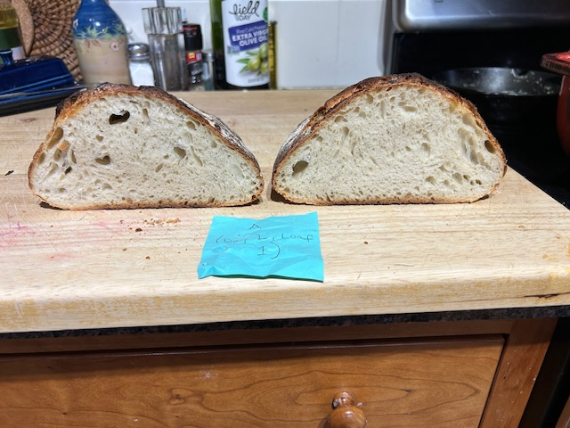
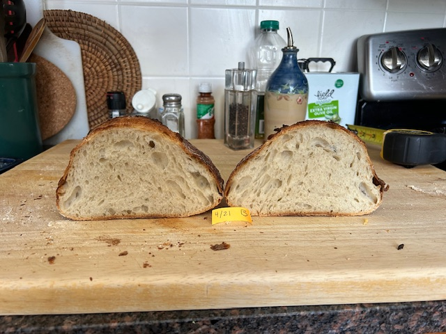
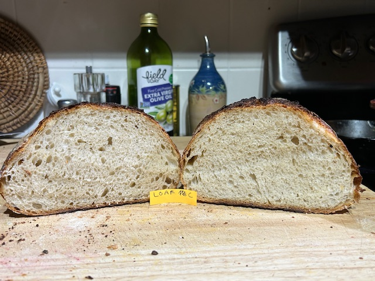
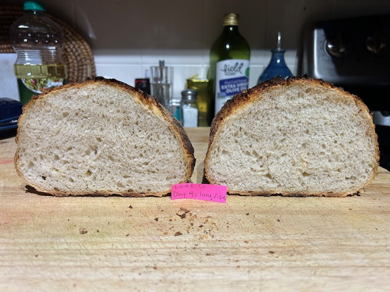

```{r setup, include=FALSE}
knitr::opts_chunk$set(echo = FALSE, warning = FALSE, message = FALSE)
```

## OBJECTIVE

The objective of my experiment is to determine if the length of time that sourdough bread rises affects the density of the loaf. The motivation for the study is that my wife has been cooking sourdough bread for over 5 years, and while the loaves are consistently of a high quality, there is noticeable variability in their “loft” and density. In general, we prefer loaves that are airier, have more loft, and are of a lower density, so this experiment is a step towards homing in on a baking procedure that might ensure that quality with more consistency. As will be demonstrated in the next section, there are numerous variables that could potentially be affecting bread density, but I am deciding to choose one in particular for this experiment, in order to keep the design simple and the statistical power high: rising time. The instructions in the recipe that will be followed in this experiment offer a very large window (“8 to 18 hours”) for the length of the bulk fermentation period between when the dough is initially mixed and the loaf is formed, and my wife generally takes advantage of this flexibility by allowing dough to rise for any number of hours in this range depending on her schedule.  Here, two specific levels will be chosen towards the endpoints of this range and will be compared: the “short rise” will be 10.5 hours, and the “long rise” will be 18 hours. 

## SOURCES OF VARIATION

The experimental units are individual loaves that will be made from scratch, so they bring no a priori sources of variation to the experiment, save for one potentially important factor that will be treated as a blocking factor in the experimental design. This is the length of time that the sourdough starter in which the active yeast resides has been sitting since it has last been “fed” (given a fresh cup of flour and water to eat at a slow pace while refrigerated). Since we have only a single sourdough starter to work with, controlling this variable would mean stretching the time frame of the whole experiment out over several months, which is infeasible given the due date of this project. Since a loaf can’t be randomly assigned to the starter that constitutes its dough, I will choose two levels of sourdough starter age (“1 day old” and “4 day old”) that work well for our schedule and reflect typical values that we would use when making bread outside of experimental constraints.
There are also a large number of noise factors that will be fixed/controlled for all experimental units:

•	Brand of flour used (King Arthur)

•	Baker (my wife)

•	Recipe used (400 g of flour, 90 degree water, 475 degree oven, etc.)

•	Rising environment (in a covered metal bowl on our counter)

•	Duration of the second rise after the loaves are formed, also known as “proofing” (3 hours)

•	Dutch oven in which the bread is baked (preheated in the oven for 15 minutes before the baking begins).


## RANDOM ASSIGNMENT

A grand total of eight loaves will be baked on 4 separate days; on each of those days, the two doughs that were made the previous evening will (after 10.5 hours have passed since being made) be randomly assigned to one of the two treatments.  A coin flip will determine which of the doughs will be formed into a loaf immediately and proceed to the proofing stage; the other dough will continue to rise for another 7.5 hours before passing on to the loaf-formation step in the recipe. 

## MEASUREMENTS

To assess density, the response variable that will be measured will be height of the loaf, measured to the nearest 1/16th of an inch. We have found that visual inspection of a loaf when it is brought out of the oven is a reliable indicator of the interior density: flatter-looking loaves are less airy, feel denser while chewing, and are overall less desirable. My wife and I will take independent measurements of this height and a random effect will be included in the model to account for inconsistencies in between-person measurement recording. Overall, then, there will be a total of N = 16 measurements recorded.

## MODEL

The model used for this experiment will be a linear mixed effects model with a blocking factor.  An interaction term between the block and treatment factors is of interest and can be included because there are enough degrees of freedom:

$$
y_{hijt} = \mu + \beta_h + \tau_j +(\beta\tau)_{hj} + \delta_i+ \epsilon_{hijt}
$$

$\delta_i \sim N(0, \sigma^2_\delta)$  and  $\epsilon_{hijt} \sim N(0, \sigma^2)$ are all mutually independent; $h = 1,2$ ; $i = 1,2$ ; $j= 1,2$ ; $t = 1,2$

## ANALYSIS

The statistical analysis will be done on the mixed effects model after the model assumptions have been checked. The two primary results that are of interest are a 95% confidence interval for difference in treatment means, as well as a test of the null hypothesis that all interaction contrasts are zero. An evaluation of the usefulness of blocking will also be done by comparing the relevant mean square ratios.

```{r, fig.height = 4, fig.width = 6}
library(ggplot2)
library(readxl)
bread.df <- read_excel("bread-project.xlsx")
# For block, 0 = "1 day", 1 = "4 day"
# For person, 0 = "Nick", 1 = "Kayje"	
# For treatment, 0 = "short rise", 1 = "long rise"

bread.df$fBlock <- as.factor(bread.df$block)
bread.df$fPerson<- as.factor(bread.df$person)
bread.df$fTreatment <- as.factor(bread.df$treatment)

# Check initial plot of results against treatment
ggplot(bread.df, aes(x= fTreatment, y = height)) + geom_point() + labs(main = "Initial plot of results")

bread.model <- aov(height ~ fBlock + fBlock:fTreatment + Error(fPerson) + fTreatment, data = bread.df, contrasts = list(fTreatment = "contr.sum"))

summary(bread.model)

bread.fixed.model <- aov(height ~ fBlock + fBlock:fTreatment + fPerson + fTreatment, data = bread.df)

# Calculate standardized residuals as though all effects were fixed
resid.bread <- residuals(bread.fixed.model) 
bread.df$st.resid <- resid.bread / sd(resid.bread)
bread.df$pred = fitted(bread.fixed.model)


# Check for mean fit & outliers: Plot st. residuals vs. treatment
ggplot(bread.df) + geom_point(aes(x = fTreatment, y = st.resid)) +  
    geom_hline(yintercept = 0, linetype = "dashed")

# Check for mean fit: Plot st. residuals vs. block
ggplot(bread.df) + geom_point(aes(x = fBlock, y = st.resid)) +  
    geom_hline(yintercept = 0, linetype = "dashed")

# Check for independence: Plot st. residuals vs. order
ggplot(bread.df, aes(x= order, y = st.resid)) + geom_point()

# Check for homoscedasticity: Plot st. residuals vs. fitted values
ggplot(bread.df) + geom_point(aes(x = pred, y = st.resid)) +  
    geom_hline(yintercept = 0, linetype = "dashed")

# Check for normal assumption on errors: Plot st. residuals vs. normal scores
qqnorm(bread.df$st.resid, ylim = c(-3, 3), xlim = c(-3,3)) 
qqline(bread.df$st.resid)


# Confidence interval for difference in treatments:
library(lsmeans)
lsmTreatment <- lsmeans(bread.model, ~ fTreatment)
summary(contrast(lsmTreatment, infer = c(T, T)))

#F-test for significance of person effect:
(.03516 / 0.00675)
(qf(.95, 1, 11))
```

## RESULTS

The model fit looks pretty good based on the diagnostics above; there is a little bit of a curved pattern in the standardized residuals vs. run order plot, but with only 16 observations total it is not too troublesome and I do not think an order covariate needs to be incorporated into the model.

I discovered a statistically significant difference in the height of loaves that were allowed to rise for 18 hours versus those that were permitted to rise for just 10.5 hours. Visual support for this difference is provided in the pictures below; we only measured the loaves at their maximum height, the first two loaves below from the "short rise" treatment can be seen to have a less rounded crest and appear flatter in profile than the bottom two loaves from the "long rise" treatment. 









A 95% confidence interval for the difference in treatment means is .041 inches to .147 inches; the average effect of allowing the bread to do its primary rise over 18 hours as opposed to 10.5 hours after blocking on the age of the sourdough starter (time since last being fed flour and water) at the time of formation was approximately one-tenth of an inch.

A test of the null hypothesis that all interaction contrasts are zero fails to reject the null. With a P-value of 0.46, there is not enough evidence to suggest an interaction between the age of the sourdough starter and the length of the rise time.

An evaluation of the usefulness of blocking shows that since the mean square for the blocking factor is greater than the mean square error (by a factor of about 15 to 1), it was useful to block in this case. The age of the sourdough starter when the loaves were formed did contribute some variation to the loaf heights that might have masked the treatment effect had the blocking not been incorporated in the experimental design.

## CONCLUSION/REFLECTION

I am glad I included a person random effect in the model; the null hypothesis of zero variance between people doing the measurement was rejected, as the ratio of mean square attributable to person to mean square error (5.21) was greater than the 95th quantile of an F distribution with 1 and 11 degrees of freedom (4.84). Upon talking to wife while writing this report up, we realized that I was measuring the height of each loaf to the what I saw as the interior of the crust, while she was measuring to what she saw as the exterior of the crust. This turned out to be an important difference- while we were each consistent internally, the variation this created between us could have led to a different conclusion about treatment effects. 

If I were to run the experiment again, I would try to remove the potential unconscious bias inherent in my design; it would have been possible (but logistically challenging) to blind the researcher to the treatment group of the loaf being measured. I also would try to come up with a more sophisticated response variable than simple height; as the pictures above show, there seemed to be an even larger difference in overall volume of the loaves between treatments, but with the non-symmetric shape that most loaves take, it is hard to measure this variable precisely. Overall, this was an enjoyable and enlightening project.

